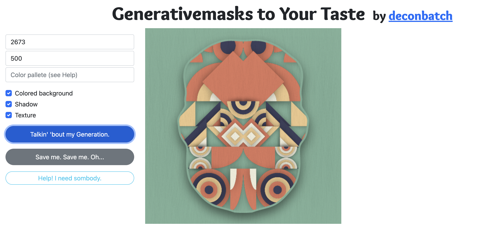
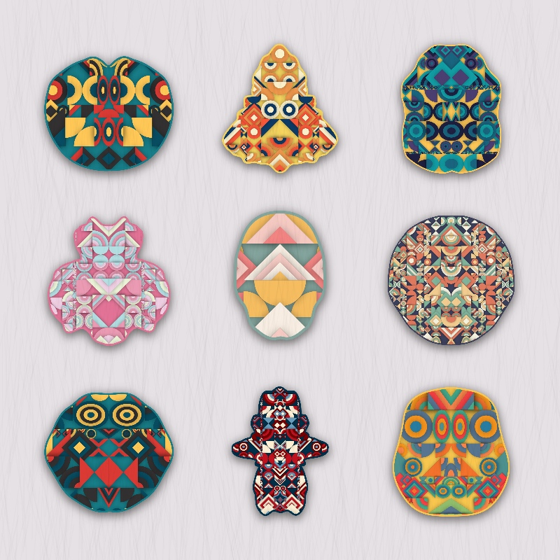
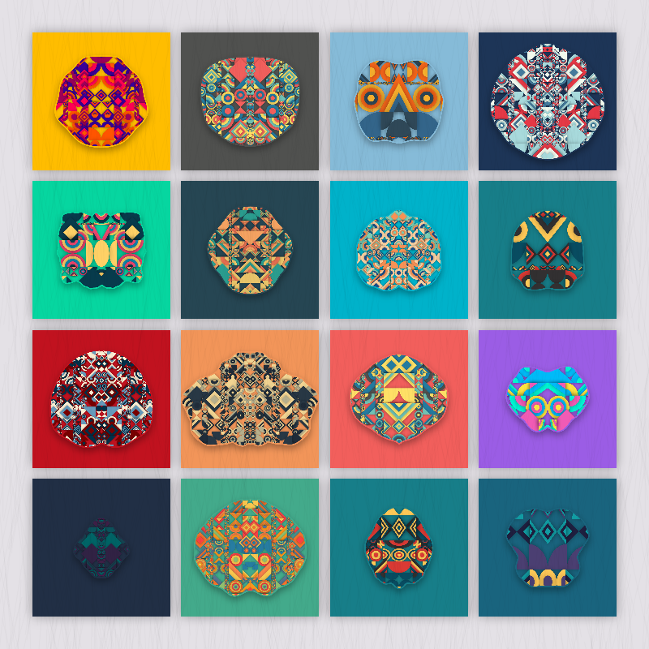
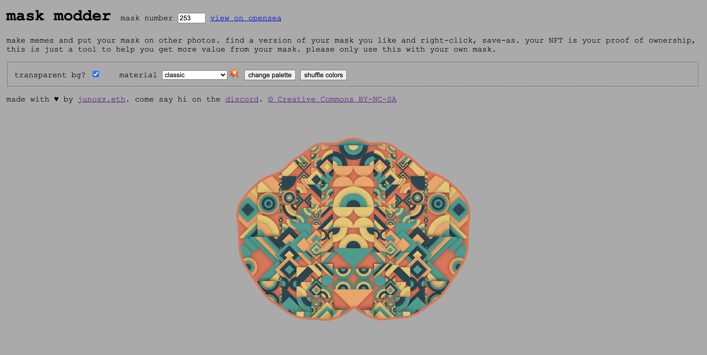
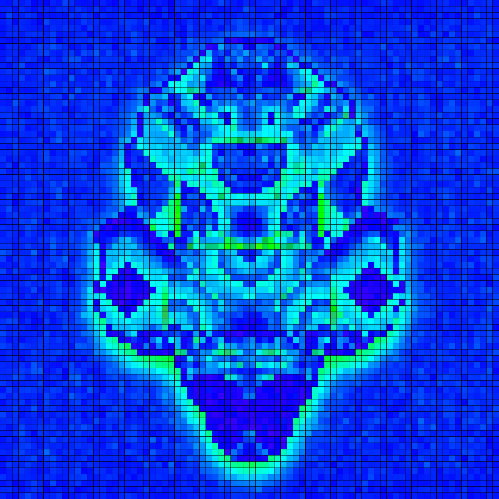

# Community Tools

## Garg

'Garg' stands for 'Generates A Resembling Generativemasks'.  
Garg is a JavaScript module. It generates a mask and it returns the result as 'p5.Graphics'. You can designate the mask size and the color palette to draw!

**Example application**  
[https://openprocessing.org/sketch/1299156](https://openprocessing.org/sketch/1299156)

For more information about the tool, check here.  
[https://www.deconbatch.com/2021/10/garg.html](https://www.deconbatch.com/2021/10/garg.html)

Creator: [`deconbatch`](https://twitter.com/deconbatch)

## NxN Tile Generator(High-Res ver.2)

  
[https://openprocessing.org/sketch/1303795/](https://openprocessing.org/sketch/1303795/)  
Creator: [`takawo`](https://twitter.com/takawo)

## Twitter Header Generator 1x1

  
[https://openprocessing.org/sketch/1300131](https://openprocessing.org/sketch/1300131)  
Creator: [`takawo`](https://twitter.com/takawo)

## PFP Collaborator

<video width="100%" controls>
  <source src="../assets/videos/pfpcollab.mp4" type="video/mp4">
</video>
[https://openprocessing.org/sketch/1250736](https://openprocessing.org/sketch/1250736)  
Creator: [`takawo`](https://twitter.com/takawo)

## Mask on the webcam

<video width="100%" controls>
  <source src="../assets/videos/webcam.mp4" type="video/mp4">
</video>
[https://openprocessing.org/sketch/1248797](https://openprocessing.org/sketch/1248797)  
Creator: [`takawo`](https://twitter.com/takawo)

## Pattern Extractor

<video width="100%" controls>
  <source src="../assets/videos/patternextractor.mp4" type="video/mp4">
</video>

[https://openprocessing.org/sketch/1250271](https://openprocessing.org/sketch/1250271)  
Creator: [`takawo`](https://twitter.com/takawo)

## 3×3 Tile Generator

<video width="100%" controls>
  <source src="../assets/videos/tilegenerator.mp4" type="video/mp4">
</video>

[https://openprocessing.org/sketch/1249649](https://openprocessing.org/sketch/1249649)  
Creator: [`takawo`](https://twitter.com/takawo)

## 4×4 Tile Generator

  
[https://openprocessing.org/sketch/1275637](https://openprocessing.org/sketch/1275637)  
Creator: [`takawo`](https://twitter.com/takawo)

## Collaborator

<video width="100%" controls>
  <source src="../assets/videos/collaborator.mp4" type="video/mp4">
</video>
[https://openprocessing.org/sketch/1250451](https://openprocessing.org/sketch/1250451)  
Creator: [`takawo`](https://twitter.com/takawo)

## Twitter Header Generator

Tiling of multiple masks is supported by entering IDs separated by commas in the field "Mask ID".
ex 1330,1200,546  
<video width="100%" controls>

  <source src="../assets/videos/twitter_header_generator.mp4" type="video/mp4">
</video>
[https://openprocessing.org/sketch/1253395](https://openprocessing.org/sketch/1253395)  
Creator: [`takawo`](https://twitter.com/takawo)

## Dither

  
[https://openprocessing.org/sketch/1225430](https://openprocessing.org/sketch/1225430)  
Creator: [`takawo`](https://twitter.com/takawo)

## Mask on Snapchat

[https://lens.snapchat.com/6b1f7e54751749328e608b9e6b386899](https://lens.snapchat.com/6b1f7e54751749328e608b9e6b386899)  
`Chicken McDougget`

## mask modder

  
[https://junosuarez.github.io/maskmod/](https://junosuarez.github.io/maskmod/)  
Creator: [`junosz.eth`](https://twitter.com/junosz)

## Analytics Dashboard

[https://dune.xyz/venture_capital/generativemasks](https://dune.xyz/venture_capital/generativemasks)  
`venture_capital`

## Mask size data

[https://docs.google.com/spreadsheets/d/1QgezImKL7meoFK52JoqjtpS1OS0ivWycErB-OOzxF_o/edit#gid=1015296609](https://docs.google.com/spreadsheets/d/1QgezImKL7meoFK52JoqjtpS1OS0ivWycErB-OOzxF_o/edit#gid=1015296609)  
`manawisdom`

## Pixelized @generativemasks generator

[https://openprocessing.org/sketch/1273176](https://openprocessing.org/sketch/1273176)  
Creator: [`wildmouse`](https://twitter.com/wildmouse_)

## Opensea sales bot

[https://twitter.com/salesbotgm/](https://twitter.com/salesbotgm/)  
`?`

## Original Script

[https://github.com/Generativemasks/generativemasks.github.io](https://github.com/Generativemasks/generativemasks.github.io)
